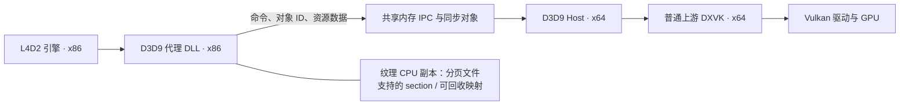

# L4D2 DXVK 32→64 Bridge — v1.0.0

一个用于 Windows《Left 4 Dead 2》的 **32 位 D3D9 → 64 位 DXVK 桥接项目**。它在游戏进程中接收 D3D9 调用，将命令及必要的资源数据发送到独立的 64 位 Host，由普通上游 DXVK 转成 Vulkan 并交给 GPU 渲染。

项目的目标是减轻 32 位游戏进程的渲染资源地址空间压力，让使用大量 Mod 的游戏有更多空间留给引擎本身。第一版同时加入可回收的纹理 shadow 映射，避免 CPU 纹理副本长期占满游戏的地址空间。

**项目面向支持 DXVK/Vulkan 的 Intel、AMD、NVIDIA 显卡，不设置显卡厂商白名单，也不启用 RTX 光追运行时。** 上游桥接代码来自 NVIDIA RTX Remix Bridge，这一来源不意味着本项目要求 NVIDIA 显卡。当前实际验证的平台是 **Intel Arc B580 + DXVK 2.6.1**；其他显卡、驱动和游戏配置仍需实测。

L4D2 的游戏引擎仍然是 32 位。桥接改变的是渲染调用的执行位置和部分资源的存储方式，不会把引擎、脚本或所有 Mod 内存改成 64 位，也不保证减少同等数量的物理内存。

## 第一版状态

v1.0.0 已由项目作者确认作为第一版本：保留全部原有 Mod 正常进入战役，反馈运行流畅、未观察到掉帧，客户端与 Host 正常退出。

| 实测项目 | 结果 |
| --- | --- |
| x86 客户端 → x64 Host → DXVK | 握手、设备创建、游戏画面与退出通过 |
| 全部既有 Mod 进入战役 | 通过本次实机测试 |
| 纹理映射缓存 | 最大预算占用 128 MiB |
| 战役中保留的纹理 shadow 数据 | 约 2.51 GiB |
| 战役中映射到 x86 的纹理 shadow | 约 107 MiB |
| 战役中 x86 空闲地址空间 | 约 2.11 GiB，最大连续空闲块约 1.30 GiB |
| 自动检查 | Windows x86/x64 编译、x86 数据恢复与缓存回收测试通过 |

这些数值来自一次约 210 秒的运行，不能当作所有地图、Mod 或设备的保证。长时间运行、连续换图、设备 Reset 及定量帧率对照仍需继续验证。详细记录见 [首次实测](docs/FIRST-GAME-VALIDATION.md)。

## 环境要求

- Windows 10/11 **64 位**，Steam 版 L4D2。
- 显卡与驱动支持 DXVK 2.6.1 所需的 Vulkan 功能；请安装合适的显卡驱动。
- 第一版完整包默认使用官方 **DXVK 2.6.1 x64**。
- 首次安装使用窗口化模式。独占全屏及第三方渲染代理混装未纳入第一版验收。

## 下载与安装

### 1. 获取正确的包

进入仓库的 [GitHub Actions](https://github.com/yeyunyyds/L4D2_Dxvk_32to64_Bridge/actions/workflows/build.yml)，打开成功的 `Build L4D2 D3D9 Bridge` 运行，在 Artifacts 下载：

| 包名 | 用途 |
| --- | --- |
| `l4d2-bridge-v1.0.0` | 首次安装，包含 x86 客户端、x64 Host、DXVK 2.6.1 和配置 |
| `l4d2-bridge-client-only` | 已装桥接且 Host 兼容时更新客户端，保留自己的 Host、DXVK 和配置 |

下载 Actions artifact 通常需要登录 GitHub。版本号见包内 `VERSION`，二进制校验值见 `SHA256.json`。更新现有安装时先阅读对应版本说明；客户端包不用于首次安装。

### 2. 退出游戏并备份

退出 L4D2，并确认任务管理器中的 `L4D2Bridge64.exe` 已退出。备份已有的 `bin/dxvk_d3d9.dll`、`bin/.l4d2bridge/` 和 Steam 启动选项。

L4D2 常见的 DXVK 安装方式有游戏根目录 `d3d9.dll` 和 `bin/dxvk_d3d9.dll` 两种。**本项目使用后者，并通过 `-vulkan` 加载。** 若此前使用根目录 `d3d9.dll` 方案，请备份后将旧文件改名为 `d3d9.dll.before-bridge`，再切换到本项目的安装方式。不要改动 Windows 系统目录里的 DLL。

### 3. 复制文件

解压完整包，将其中 `bin` 的内容复制到 L4D2 的 `bin` 目录，保留隐藏目录 `.l4d2bridge`。最终结构如下：

```text
Steam/steamapps/common/Left 4 Dead 2/
├─ left4dead2.exe
└─ bin/
   ├─ dxvk_d3d9.dll                 # x86 客户端，游戏加载它
   └─ .l4d2bridge/
      ├─ L4D2Bridge64.exe           # x64 Host，由客户端启动
      ├─ d3d9vk_x64.dll             # 官方 DXVK 2.6.1 x64 的 d3d9.dll，重命名后使用
      └─ bridge.conf               # 桥接配置
```

三个二进制的角色不同：`bin/dxvk_d3d9.dll` 必须是本项目的 **32 位客户端**，不能用普通 DXVK DLL 代替；`d3d9vk_x64.dll` 必须是 **64 位 DXVK**。不要将 TXVK、RTX Remix 或其他代理的文件混入此目录。

Host 需要客户端提供的会话参数。**不需要双击 EXE，也不要手动提前启动它。** 单独双击可能创建运行目录后退出，这不代表游戏安装失败。

### 4. 设置启动选项并运行

Steam → L4D2 → 属性 → 启动选项：

```text
-vulkan -insecure -windowed -console -condebug
```

`-vulkan` 选择游戏的 `bin/dxvk_d3d9.dll` 加载路径，本项目实际接收的接口仍是 D3D9。`-insecure` 使用非 VAC 安全模式；需要 VAC 安全模式时请恢复原始安装。其余选项用于窗口化及控制台日志。

从 Steam 启动游戏，确认菜单、战役画面、贴图和输入正常。任务管理器中应出现 `L4D2Bridge64.exe`。正常退出游戏时，Host 也应退出。

第一次在自己的设备上测试，先确认能进入游戏，再使用日常 Mod 组合。不要依靠 Host 进程存在这一点判断渲染成功。

### 5. 已有安装的更新与卸载

如果已运行本项目并希望保留现用后端，关闭游戏和 Host 后只替换客户端包的 `bin/dxvk_d3d9.dll`。第一版保留上游握手版本标识；今后若修改协议或版本匹配规则，更新时应同时更换客户端与 Host。

卸载时关闭游戏和 Host，恢复备份的 `bin/dxvk_d3d9.dll`、桥接目录和 Steam 启动选项。若原来使用根目录 `d3d9.dll`，恢复它的原名。只删除本项目安装或运行生成的文件，不要删除其他 Mod 的内容。

## 配置与日志

主要配置位于 `bin/.l4d2bridge/bridge.conf`：

| 配置 | 第一版默认值 | 作用 |
| --- | --- | --- |
| `server.useVanillaDxvk` | `True` | 使用普通 DXVK 后端 |
| `exposeRemixApi` | `False` | 不向游戏暴露 Remix API |
| `forceX64Server` | `True` | 使用 x64 Host |
| `client.forceWindowed` | `True` | 强制窗口化 |
| `useSharedHeap` | `False` | 使用当前已验证的资源上传路径；命令通道仍使用共享内存 |
| `client.surfaceShadowCacheMB` | `128` | 纹理映射缓存预算，单位 MiB；0 表示解锁后不缓存，最大有效值 1024 |
| `clientChannelMemSize` | `96MB` | 客户端 IPC 数据通道容量 |
| `logLevel` | `Info` | 普通日志级别 |
| `logApiCalls` / `logServerCommands` | `False` / `False` | 关闭逐调用日志，避免性能和磁盘开销 |

`client.surfaceShadowCacheMB` 未写入旧配置时也默认 128。活动锁定的映射不会被回收，因此同时锁定大资源时可以暂时超过预算。

| 日志 | 位置与用途 |
| --- | --- |
| `bridge32.log`、`bridge64.log` | 上游默认位于游戏工作目录的 `rtx-remix/logs/`，记录两端启动、握手、设备创建和退出；找不到时在游戏目录搜索同名文件 |
| `l4d2-memory.log` | 固定在游戏 `bin/`，记录 x86 地址空间、shadow 保留数据和映射缓存 |
| `console.log` | 启用 `-condebug` 后由游戏写入，通常位于 `left4dead2/` |
| DXVK 日志 | 由 x64 后端写入，位置受工作目录和 `DXVK_LOG_PATH` 影响 |

保留 `rtx-remix` 日志目录和内部 Remix 接口名称是为减少对上游的侵入，不表示已启用 RTX 渲染。

内存日志每个新进程首次采样覆盖旧文件。发生问题后立即复制保存 `l4d2-memory.log` 和两侧日志，再重新启动游戏。采样间隔约五秒，由绘制和资源操作触发，没有后台轮询线程。详细字段见 [内存诊断说明](docs/MEMORY-DIAGNOSTICS.md)。

`surface_bytes` 是当前映射的数据量，`surface_backing_bytes` 是仍然保留的纹理副本总量，`surface_view_budget_bytes` 是计入映射对齐开销后的缓存占用。判断 x86 地址空间余量应看 `va_free` 和 `largest_free`。游戏 `mem_dump` 若出现负数或明显异常的 OS 统计，不能据此判断真实内存余量。

## 从源码构建

工具链：Visual Studio 2022，安装 **MSVC v142 / 14.29 的 x86/x64 工具**和 Windows SDK；Python 3.11、Git。构建在 Windows PowerShell 中执行：

```powershell
python -m pip install meson==1.3.2 ninja==1.11.1.1
./scripts/build_bridge.ps1 -DxvkDll C:/dxvk-2.6.1/x64/d3d9.dll
./scripts/test_diagnostics.ps1
```

脚本从固定上游提交 `9aa74f8dfad2188efbd0f717c64d9f8fa909787e` 准备 Bridge，只初始化所需的 Detours 子模块，应用 [项目补丁](patches/l4d2-bridge.patch)，分别编译 x86 客户端和 x64 Host。无需构建 RTX 渲染器或下载 NVIDIA GPU SDK 子模块。

输出完整包 `dist/l4d2-bridge/` 和客户端包 `dist/l4d2-client-only/`。打包前检查实际 PE 架构并生成 SHA-256 清单，同时携带项目与第三方许可。脚本拒绝覆盖已有输出；重新打包前请保留或移走旧目录。

如果 `.deps/dxvk-remix` 已应用旧版补丁，准备脚本会拒绝覆盖无法识别的修改。先备份其中的本地修改，再移走该依赖目录并重新运行，让脚本获取干净的固定提交。

GitHub Actions 在 `main`、开发分支及手动触发时执行相同构建与 x86 自动测试，并提供两个下载包。构建与设备验证步骤见 [TESTING.md](docs/TESTING.md)。

## 实现流程

### 1. 游戏加载代理，启动独立 Host

L4D2 根据 `-vulkan` 加载 `bin/dxvk_d3d9.dll`。这个 DLL 导出游戏需要的 D3D9 入口，创建本地代理对象，建立带会话 GUID 的命令、数据和消息通道，并启动 `.l4d2bridge/L4D2Bridge64.exe`。两端握手后开始处理调用。



### 2. D3D9 对象与调用转发

游戏拿到的是 x86 代理接口，例如设备、纹理、表面、顶点/索引缓冲、着色器和查询对象。代理把方法调用编码成命令，带上对象 ID 和参数发送到 Host。Host 根据 ID 找到自己进程里的真实 D3D9 对象，再执行对应方法。

两端通过 ID 关联资源，**不会把 x86 的 C++ 对象指针直接当作 x64 对象指针使用**。普通状态设置和绘制通过命令转发；资源创建及需要返回数据的调用使用对应的响应路径。COM 引用计数和最终销毁沿用上游的代理生命周期机制。

### 3. 普通 DXVK 后端与窗口呈现

Host 从自身目录的绝对路径加载 `d3d9vk_x64.dll`，检查 `Direct3DCreate9` 导出，调用公开的 D3D9 入口创建设备。普通后端模式跳过 Remix 专用的特性版本查询，不要求 RTX 渲染 DLL。

窗口由游戏创建和持有，游戏的 `HWND` 随设备创建参数送到 Host，DXVK 使用该窗口呈现画面。窗口句柄是 Windows 管理的标识，不等于需要跨进程复用的普通内存指针。上游窗口过程协调层仍保留，用于活动状态、消息与退出处理；本项目配置关闭消息泵钩子和部分额外窗口钩子，强制窗口化。Host 负责渲染后端和命令执行，而不只是一层传话器。

### 4. 纹理、顶点和索引数据上传

当游戏 `LockRect` 或锁定缓冲区时，客户端提供有效的 CPU 地址让游戏写入。解锁时，客户端按锁定区域、格式、行跨度和标志，把需要上传的数据复制到现有 IPC 通道；Host 再更新 x64 侧资源。只转发绘制命令而不传资源内容，无法完成正确渲染。

第一版保留上游的顶点/索引 shadow 路径，并修改非共享堆路径的纹理表面 shadow。没有整体迁移引擎的模型缓存、脚本、音频或其他游戏堆。

### 5. 可回收的纹理 shadow 映射

旧路径将每份纹理 CPU 副本长期留在 x86 地址空间。重度 Mod 加载时，实测纹理副本增长到约 2.08 GiB，加上其他分配后，空闲地址空间仅剩约 147 MiB。

第一版新增 `PagefileShadow`，以 Windows 内核管理的分页文件支持 section 保存每个表面的 CPU 数据：

1. 首次锁定，用 `CreateFileMappingW(INVALID_HANDLE_VALUE, ...)` 创建 section，通过 `MapViewOfFile` 获得 x86 可访问的地址。
2. 锁定期间保持映射有效；嵌套锁计数保证尚未全部解锁时不回收。
3. 解锁时先将写入内容复制进 IPC，然后将未锁定映射放入最近使用顺序的缓存。
4. 缓存超过预算时，对最久未使用且未锁定的映射调用 `UnmapViewOfFile`，释放它在 x86 中占用的地址空间。预算计入 Windows 分配粒度的对齐开销，控制大量小 mip 映射造成的碎片。
5. section 保留原来的数据。再次锁定时重新映射，无需从 GPU 回读，游戏此前写入的内容仍然存在。映射失败时会清空可回收缓存再尝试一次。
6. 表面销毁时取消映射并关闭 section 句柄；映射或 section 创建失败会记录 Win32 错误，并让锁定失败。

这个 section 的句柄由客户端持有，不直接作为游戏资源对象句柄传给 Host。跨进程上传仍使用原来的 IPC。**取消映射只释放 x86 地址空间，不删除保留数据，也不消除其系统提交量、物理内存或分页文件需求。**

### 6. 诊断、构建和验证

新增诊断通过 `VirtualQuery` 扫描 x86 地址空间，记录已提交、已保留、总空闲及最大连续空闲块；通过系统 API 记录进程内存，并区分纹理 backing 总量和当前映射量。统计不包含所有引擎内存，不能替代系统级总内存测量。

Windows x86 自动测试覆盖映射回收后内容恢复、活动锁及嵌套锁的指针有效性、小纹理映射预算控制、销毁后的计数清理，以及分配失败诊断。实机验收另外检查真正的战役画面、Mod、运行表现及两端退出。第一版还未覆盖所有设备、长期运行、Reset 或第三方覆盖层。

## 原作者归属、生成代码署名与 Credit

**原始代码归各原作者所有。** 本项目基于开源组件进行复用和修改，不将上游 Bridge、DXVK、Detours 或其他第三方代码声明为项目作者独立原创。

**本项目新增及修改的代码由 yeyunyyds（GitHub 用户名）完全使用 ChatGPT-6.1 Sol 生成。** 该署名适用于本仓库新增的构建/打包脚本、测试、诊断及映射缓存代码，以及项目补丁中的修改部分；补丁上下文和保留的原始代码仍属于对应原作者。项目需求、实机测试和第一版确认由 [yeyunyyds](https://github.com/yeyunyyds) 完成。

| 来源 | Credit 与用途 | 许可 |
| --- | --- | --- |
| [NVIDIA RTX Remix Bridge / dxvk-remix](https://github.com/NVIDIAGameWorks/dxvk-remix) | NVIDIA CORPORATION & AFFILIATES 及上游贡献者；提供 x86/x64 桥接、资源代理、IPC、窗口协调和生命周期基础 | Bridge 的 MIT 许可及所含第三方许可 |
| [DXVK](https://github.com/doitsujin/dxvk) | Philip Rebohle、Joshua Ashton、Robin Kertels、Jeffrey Ellison 及贡献者；提供 D3D9 → Vulkan 后端 | zlib/libpng |
| [Microsoft Detours](https://github.com/microsoft/Detours) | Microsoft Corporation 及贡献者；提供 API 钩子基础 | MIT |
| [Tracy](https://github.com/wolfpld/tracy) | Bartosz Taudul 及贡献者；上游桥接所含性能分析组件 | BSD-3-Clause |
| [TXVK](https://github.com/tianxiaols/TXVK) | tianxiaols；其公开发布物、配置和文档为 L4D2 桥接行为分析提供参考，本项目未复制其定制代码或再分发其二进制 | 参考项目，见其自身许可 |
| L4D2 / Steam | Valve；提供游戏及运行平台 | 游戏和平台版权归 Valve，不包含于本项目许可 |

完整组件归属与许可清单见 [THIRD_PARTY.md](THIRD_PARTY.md)。分发时请保留原始版权、许可和包内 `licenses/` 文件。

## MIT 许可

本项目新增代码与修改部分采用 **MIT License**，Copyright © 2026 yeyunyyds，完整条款见 [LICENSE](LICENSE)。允许使用、复制、修改和再分发，但须保留适用的版权和许可声明，软件按原样提供。

原始代码仍归原作者所有，并遵循各自许可。MIT 许可不重新授权 DXVK 的 zlib/libpng、Tracy 的 BSD-3-Clause 或其他第三方组件，也不覆盖 L4D2、Steam 和显卡驱动。
