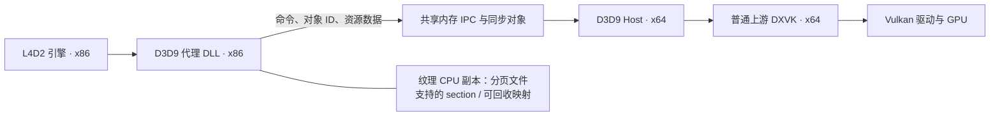
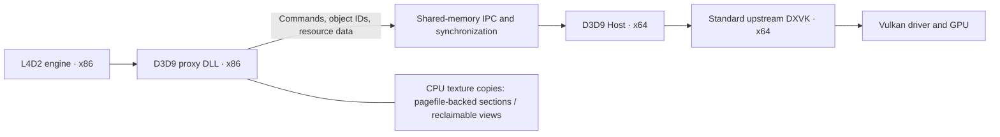

# L4D2 DXVK 32→64 Bridge — v1.0.0

[中文](#chinese) | [English](#english)

<a id="chinese"></a>

一个用于 Windows《Left 4 Dead 2》的 **32 位 D3D9 → 64 位 DXVK 桥接项目**。它在游戏进程中接收 D3D9 调用，将命令及必要的资源数据发送到独立的 64 位 Host，由普通上游 DXVK 转成 Vulkan 并交给 GPU 渲染。

项目的目标是减轻 32 位游戏进程的渲染资源地址空间压力，让使用大量 Mod 的游戏有更多空间留给引擎本身。第一版同时加入可回收的纹理 shadow 映射，避免 CPU 纹理副本长期占满游戏的地址空间。

**项目面向支持 DXVK/Vulkan 的 Intel、AMD、NVIDIA 显卡，不设置显卡厂商白名单，也不启用 RTX 光追运行时。** 上游桥接代码来自 NVIDIA RTX Remix Bridge，这一来源不意味着本项目要求 NVIDIA 显卡。当前实际验证的平台是 **Intel Arc B580 + DXVK 2.6.1**；其他显卡、驱动和游戏配置仍需实测。

L4D2 的游戏引擎仍然是 32 位。桥接改变的是渲染调用的执行位置和部分资源的存储方式，不会把引擎、脚本或所有 Mod 内存改成 64 位，也不保证减少同等数量的物理内存。

## 第一版状态

v1.0.0 已由项目作者确认作为第一版本：保留全部原有 Mod 正常进入战役，反馈运行流畅、未观察到掉帧，客户端与 Host 正常退出。

| 实测项目 | 结果 |
| --- | --- |
| x86 客户端 → x64 Host → DXVK | 握手、设备创建、游戏画面与退出通过 |
| 全部既有 Mod 进入战役 | 通过本次实机测试 |
| 纹理映射缓存 | 最大预算占用 128 MiB |
| 战役中保留的纹理 shadow 数据 | 约 2.51 GiB |
| 战役中映射到 x86 的纹理 shadow | 约 107 MiB |
| 战役中 x86 空闲地址空间 | 约 2.11 GiB，最大连续空闲块约 1.30 GiB |
| 自动检查 | Windows x86/x64 编译、x86 数据恢复与缓存回收测试通过 |

这些数值来自一次约 210 秒的运行，不能当作所有地图、Mod 或设备的保证。长时间运行、连续换图、设备 Reset 及定量帧率对照仍需继续验证。详细记录见 [首次实测](docs/FIRST-GAME-VALIDATION.md)。

## 环境要求

- Windows 10/11 **64 位**，Steam 版 L4D2。
- 显卡与驱动支持 DXVK 2.6.1 所需的 Vulkan 功能；请安装合适的显卡驱动。
- 第一版完整包默认使用官方 **DXVK 2.6.1 x64**。
- 首次安装使用窗口化模式。独占全屏及第三方渲染代理混装未纳入第一版验收。

## 下载与安装

### 1. 获取正确的包

进入仓库的 [GitHub Actions](https://github.com/yeyunyyds/L4D2_Dxvk_32to64_Bridge/actions/workflows/build.yml)，打开成功的 `Build L4D2 D3D9 Bridge` 运行，在 Artifacts 下载：

| 包名 | 用途 |
| --- | --- |
| `l4d2-bridge-v1.0.0` | 首次安装，包含 x86 客户端、x64 Host、DXVK 2.6.1 和配置 |
| `l4d2-bridge-client-only` | 已装桥接且 Host 兼容时更新客户端，保留自己的 Host、DXVK 和配置 |

下载 Actions artifact 通常需要登录 GitHub。版本号见包内 `VERSION`，二进制校验值见 `SHA256.json`。更新现有安装时先阅读对应版本说明；客户端包不用于首次安装。

### 2. 退出游戏并备份

退出 L4D2，并确认任务管理器中的 `L4D2Bridge64.exe` 已退出。备份已有的 `bin/dxvk_d3d9.dll`、`bin/.l4d2bridge/` 和 Steam 启动选项。

L4D2 常见的 DXVK 安装方式有游戏根目录 `d3d9.dll` 和 `bin/dxvk_d3d9.dll` 两种。**本项目使用后者，并通过 `-vulkan` 加载。** 若此前使用根目录 `d3d9.dll` 方案，请备份后将旧文件改名为 `d3d9.dll.before-bridge`，再切换到本项目的安装方式。不要改动 Windows 系统目录里的 DLL。

### 3. 复制文件

解压完整包，将其中 `bin` 的内容复制到 L4D2 的 `bin` 目录，保留隐藏目录 `.l4d2bridge`。最终结构如下：

```text
Steam/steamapps/common/Left 4 Dead 2/
├─ left4dead2.exe
└─ bin/
   ├─ dxvk_d3d9.dll                 # x86 客户端，游戏加载它
   └─ .l4d2bridge/
      ├─ L4D2Bridge64.exe           # x64 Host，由客户端启动
      ├─ d3d9vk_x64.dll             # 官方 DXVK 2.6.1 x64 的 d3d9.dll，重命名后使用
      └─ bridge.conf               # 桥接配置
```

三个二进制的角色不同：`bin/dxvk_d3d9.dll` 必须是本项目的 **32 位客户端**，不能用普通 DXVK DLL 代替；`d3d9vk_x64.dll` 必须是 **64 位 DXVK**。不要将 TXVK、RTX Remix 或其他代理的文件混入此目录。

Host 需要客户端提供的会话参数。**不需要双击 EXE，也不要手动提前启动它。** 单独双击可能创建运行目录后退出，这不代表游戏安装失败。

### 4. 设置启动选项并运行

Steam → L4D2 → 属性 → 启动选项：

```text
-vulkan -insecure -windowed -console -condebug
```

`-vulkan` 选择游戏的 `bin/dxvk_d3d9.dll` 加载路径，本项目实际接收的接口仍是 D3D9。`-insecure` 使用非 VAC 安全模式；需要 VAC 安全模式时请恢复原始安装。其余选项用于窗口化及控制台日志。

从 Steam 启动游戏，确认菜单、战役画面、贴图和输入正常。任务管理器中应出现 `L4D2Bridge64.exe`。正常退出游戏时，Host 也应退出。

第一次在自己的设备上测试，先确认能进入游戏，再使用日常 Mod 组合。不要依靠 Host 进程存在这一点判断渲染成功。

### 5. 已有安装的更新与卸载

如果已运行本项目并希望保留现用后端，关闭游戏和 Host 后只替换客户端包的 `bin/dxvk_d3d9.dll`。第一版保留上游握手版本标识；今后若修改协议或版本匹配规则，更新时应同时更换客户端与 Host。

卸载时关闭游戏和 Host，恢复备份的 `bin/dxvk_d3d9.dll`、桥接目录和 Steam 启动选项。若原来使用根目录 `d3d9.dll`，恢复它的原名。只删除本项目安装或运行生成的文件，不要删除其他 Mod 的内容。

## 配置与日志

主要配置位于 `bin/.l4d2bridge/bridge.conf`：

| 配置 | 第一版默认值 | 作用 |
| --- | --- | --- |
| `server.useVanillaDxvk` | `True` | 使用普通 DXVK 后端 |
| `exposeRemixApi` | `False` | 不向游戏暴露 Remix API |
| `forceX64Server` | `True` | 使用 x64 Host |
| `client.forceWindowed` | `True` | 强制窗口化 |
| `useSharedHeap` | `False` | 使用当前已验证的资源上传路径；命令通道仍使用共享内存 |
| `client.surfaceShadowCacheMB` | `128` | 纹理映射缓存预算，单位 MiB；0 表示解锁后不缓存，最大有效值 1024 |
| `clientChannelMemSize` | `96MB` | 客户端 IPC 数据通道容量 |
| `logLevel` | `Info` | 普通日志级别 |
| `logApiCalls` / `logServerCommands` | `False` / `False` | 关闭逐调用日志，避免性能和磁盘开销 |

`client.surfaceShadowCacheMB` 未写入旧配置时也默认 128。活动锁定的映射不会被回收，因此同时锁定大资源时可以暂时超过预算。

| 日志 | 位置与用途 |
| --- | --- |
| `bridge32.log`、`bridge64.log` | 上游默认位于游戏工作目录的 `rtx-remix/logs/`，记录两端启动、握手、设备创建和退出；找不到时在游戏目录搜索同名文件 |
| `l4d2-memory.log` | 固定在游戏 `bin/`，记录 x86 地址空间、shadow 保留数据和映射缓存 |
| `l4d2-host-memory.log` | 新 Host 固定写入 `bin/.l4d2bridge/`，记录 x64 内存、CPU 用时、命令速率和资源表计数 |
| `console.log` | 启用 `-condebug` 后由游戏写入，通常位于 `left4dead2/` |
| DXVK 日志 | 由 x64 后端写入，位置受工作目录和 `DXVK_LOG_PATH` 影响 |

保留 `rtx-remix` 日志目录和内部 Remix 接口名称是为减少对上游的侵入，不表示已启用 RTX 渲染。

内存日志每个新进程首次采样覆盖旧文件。发生问题后立即复制保存 `l4d2-memory.log` 和两侧日志，再重新启动游戏。采样间隔约五秒，由绘制和资源操作触发，没有后台轮询线程。详细字段见 [内存诊断说明](docs/MEMORY-DIAGNOSTICS.md)。

`surface_bytes` 是当前映射的数据量，`surface_backing_bytes` 是仍然保留的纹理副本总量，`surface_view_budget_bytes` 是计入映射对齐开销后的缓存占用。判断 x86 地址空间余量应看 `va_free` 和 `largest_free`。游戏 `mem_dump` 若出现负数或明显异常的 OS 统计，不能据此判断真实内存余量。

Host 内存／CPU 诊断更新提供独立的 `l4d2-bridge-host-diagnostics` 包，可只替换 Host EXE，继续使用已有 v1.0.0 客户端与 DXVK。它用于定位增长来源，不是内存优化修复。安装、字段和同场景对比方法见 [Host 诊断说明](docs/HOST-MEMORY-DIAGNOSTICS.md)。每轮结束保存四份日志，新进程会覆盖同名文件。

命令队列 CPU 测试版提供 `l4d2-bridge-cpu-update` 包，需要同时更新客户端 DLL 与 Host EXE。它通过跨进程事件唤醒空队列的消费者，减少等待期间的 CPU 开销；游戏帧率与稳定性仍待实测。安装和验证见 [CPU 测试说明](docs/CPU-QUEUE-TEST.md)。第二轮增加仅桥／游戏内部的等待计数并合并重复唤醒；纹理资源池尚未实现，设计见 [纹理复用说明](docs/TEXTURE-REUSE-DESIGN.md)。

## 从源码构建

工具链：Visual Studio 2022，安装 **MSVC v142 / 14.29 的 x86/x64 工具**和 Windows SDK；Python 3.11、Git。构建在 Windows PowerShell 中执行：

```powershell
python -m pip install meson==1.3.2 ninja==1.11.1.1
./scripts/build_bridge.ps1 -DxvkDll C:/dxvk-2.6.1/x64/d3d9.dll
./scripts/test_diagnostics.ps1
./scripts/test_host_diagnostics.ps1
./scripts/test_command_queue.ps1
```

脚本从固定上游提交 `9aa74f8dfad2188efbd0f717c64d9f8fa909787e` 准备 Bridge，只初始化所需的 Detours 子模块，应用 [项目补丁](patches/l4d2-bridge.patch)，分别编译 x86 客户端和 x64 Host。无需构建 RTX 渲染器或下载 NVIDIA GPU SDK 子模块。

输出完整包 `dist/l4d2-bridge/` 和客户端包 `dist/l4d2-client-only/`。打包前检查实际 PE 架构并生成 SHA-256 清单，同时携带项目与第三方许可。脚本拒绝覆盖已有输出；重新打包前请保留或移走旧目录。

如果 `.deps/dxvk-remix` 已应用旧版补丁，准备脚本会拒绝覆盖无法识别的修改。先备份其中的本地修改，再移走该依赖目录并重新运行，让脚本获取干净的固定提交。

GitHub Actions 在 `main`、开发分支及手动触发时执行相同构建与 x86 自动测试，并提供两个下载包。构建与设备验证步骤见 [TESTING.md](docs/TESTING.md)。

## 实现流程

### 1. 游戏加载代理，启动独立 Host

L4D2 根据 `-vulkan` 加载 `bin/dxvk_d3d9.dll`。这个 DLL 导出游戏需要的 D3D9 入口，创建本地代理对象，建立带会话 GUID 的命令、数据和消息通道，并启动 `.l4d2bridge/L4D2Bridge64.exe`。两端握手后开始处理调用。



### 2. D3D9 对象与调用转发

游戏拿到的是 x86 代理接口，例如设备、纹理、表面、顶点/索引缓冲、着色器和查询对象。代理把方法调用编码成命令，带上对象 ID 和参数发送到 Host。Host 根据 ID 找到自己进程里的真实 D3D9 对象，再执行对应方法。

两端通过 ID 关联资源，**不会把 x86 的 C++ 对象指针直接当作 x64 对象指针使用**。普通状态设置和绘制通过命令转发；资源创建及需要返回数据的调用使用对应的响应路径。COM 引用计数和最终销毁沿用上游的代理生命周期机制。

### 3. 普通 DXVK 后端与窗口呈现

Host 从自身目录的绝对路径加载 `d3d9vk_x64.dll`，检查 `Direct3DCreate9` 导出，调用公开的 D3D9 入口创建设备。普通后端模式跳过 Remix 专用的特性版本查询，不要求 RTX 渲染 DLL。

窗口由游戏创建和持有，游戏的 `HWND` 随设备创建参数送到 Host，DXVK 使用该窗口呈现画面。窗口句柄是 Windows 管理的标识，不等于需要跨进程复用的普通内存指针。上游窗口过程协调层仍保留，用于活动状态、消息与退出处理；本项目配置关闭消息泵钩子和部分额外窗口钩子，强制窗口化。Host 负责渲染后端和命令执行，而不只是一层传话器。

### 4. 纹理、顶点和索引数据上传

当游戏 `LockRect` 或锁定缓冲区时，客户端提供有效的 CPU 地址让游戏写入。解锁时，客户端按锁定区域、格式、行跨度和标志，把需要上传的数据复制到现有 IPC 通道；Host 再更新 x64 侧资源。只转发绘制命令而不传资源内容，无法完成正确渲染。

第一版保留上游的顶点/索引 shadow 路径，并修改非共享堆路径的纹理表面 shadow。没有整体迁移引擎的模型缓存、脚本、音频或其他游戏堆。

### 5. 可回收的纹理 shadow 映射

旧路径将每份纹理 CPU 副本长期留在 x86 地址空间。重度 Mod 加载时，实测纹理副本增长到约 2.08 GiB，加上其他分配后，空闲地址空间仅剩约 147 MiB。

第一版新增 `PagefileShadow`，以 Windows 内核管理的分页文件支持 section 保存每个表面的 CPU 数据：

1. 首次锁定，用 `CreateFileMappingW(INVALID_HANDLE_VALUE, ...)` 创建 section，通过 `MapViewOfFile` 获得 x86 可访问的地址。
2. 锁定期间保持映射有效；嵌套锁计数保证尚未全部解锁时不回收。
3. 解锁时先将写入内容复制进 IPC，然后将未锁定映射放入最近使用顺序的缓存。
4. 缓存超过预算时，对最久未使用且未锁定的映射调用 `UnmapViewOfFile`，释放它在 x86 中占用的地址空间。预算计入 Windows 分配粒度的对齐开销，控制大量小 mip 映射造成的碎片。
5. section 保留原来的数据。再次锁定时重新映射，无需从 GPU 回读，游戏此前写入的内容仍然存在。映射失败时会清空可回收缓存再尝试一次。
6. 表面销毁时取消映射并关闭 section 句柄；映射或 section 创建失败会记录 Win32 错误，并让锁定失败。

这个 section 的句柄由客户端持有，不直接作为游戏资源对象句柄传给 Host。跨进程上传仍使用原来的 IPC。**取消映射只释放 x86 地址空间，不删除保留数据，也不消除其系统提交量、物理内存或分页文件需求。**

### 6. 诊断、构建和验证

新增诊断通过 `VirtualQuery` 扫描 x86 地址空间，记录已提交、已保留、总空闲及最大连续空闲块；通过系统 API 记录进程内存，并区分纹理 backing 总量和当前映射量。统计不包含所有引擎内存，不能替代系统级总内存测量。

Windows x86 自动测试覆盖映射回收后内容恢复、活动锁及嵌套锁的指针有效性、小纹理映射预算控制、销毁后的计数清理，以及分配失败诊断。实机验收另外检查真正的战役画面、Mod、运行表现及两端退出。第一版还未覆盖所有设备、长期运行、Reset 或第三方覆盖层。

## 原作者归属、生成代码署名与 Credit

**原始代码归各原作者所有。** 本项目基于开源组件进行复用和修改，不将上游 Bridge、DXVK、Detours 或其他第三方代码声明为项目作者独立原创。

对于本项目新增的实现，明确注明：

> All newly added implementation code in this fork was generated by OpenAI Codex from prompts and specifications provided by yeyunyyds.

这包括本仓库新增的构建/打包脚本、测试、诊断、映射缓存代码及项目补丁中新加入的实现。补丁上下文和保留的原始代码仍归对应原作者所有，生成来源声明不改变上游版权或许可。项目需求、规格、实机测试和第一版确认由 [yeyunyyds](https://github.com/yeyunyyds) 提供或完成。

| 来源 | Credit 与用途 | 许可 |
| --- | --- | --- |
| [NVIDIA RTX Remix Bridge / dxvk-remix](https://github.com/NVIDIAGameWorks/dxvk-remix) | NVIDIA CORPORATION & AFFILIATES 及上游贡献者；提供 x86/x64 桥接、资源代理、IPC、窗口协调和生命周期基础 | Bridge 的 MIT 许可及所含第三方许可 |
| [DXVK](https://github.com/doitsujin/dxvk) | Philip Rebohle、Joshua Ashton、Robin Kertels、Jeffrey Ellison 及贡献者；提供 D3D9 → Vulkan 后端 | zlib/libpng |
| [Microsoft Detours](https://github.com/microsoft/Detours) | Microsoft Corporation 及贡献者；提供 API 钩子基础 | MIT |
| [Tracy](https://github.com/wolfpld/tracy) | Bartosz Taudul 及贡献者；上游桥接所含性能分析组件 | BSD-3-Clause |
| [TXVK](https://github.com/tianxiaols/TXVK) | tianxiaols 及 TXVK contributors；其公开发布物、配置和文档为 L4D2 桥接行为分析提供参考，本项目未复制其定制代码或再分发其二进制 | MIT（参考项目，见其 [LICENSE](https://github.com/tianxiaols/TXVK/blob/main/LICENSE)） |
| L4D2 / Steam | Valve；提供游戏及运行平台 | 游戏和平台版权归 Valve，不包含于本项目许可 |

完整组件归属与许可清单见 [THIRD_PARTY.md](THIRD_PARTY.md)。分发时请保留原始版权、许可和包内 `licenses/` 文件。

## MIT 许可

本项目新增代码与修改部分采用 **MIT License**，Copyright © 2026 yeyunyyds，完整条款见 [LICENSE](LICENSE)。允许使用、复制、修改和再分发，但须保留适用的版权和许可声明，软件按原样提供。

原始代码仍归原作者所有，并遵循各自许可。MIT 许可不重新授权 DXVK 的 zlib/libpng、Tracy 的 BSD-3-Clause 或其他第三方组件，也不覆盖 L4D2、Steam 和显卡驱动。

---

<a id="english"></a>

# English — L4D2 DXVK 32→64 Bridge v1.0.0

A **32-bit D3D9 to 64-bit DXVK bridge** for *Left 4 Dead 2* on Windows. The client receives D3D9 calls inside the game process and sends commands and required resource data to a separate 64-bit Host. Standard upstream DXVK translates those calls to Vulkan for GPU rendering.

The project aims to reduce rendering-related address-space pressure in the 32-bit game process, leaving more room for the engine when many mods are installed. Version 1.0.0 also adds reclaimable texture shadow mappings so CPU texture copies do not permanently occupy large portions of the game's address space.

**The implementation targets Intel, AMD, and NVIDIA GPUs that support the required DXVK/Vulkan features. It has no GPU-vendor whitelist and does not enable the RTX ray-tracing runtime.** Its bridge foundation comes from NVIDIA RTX Remix Bridge; that attribution does not imply a requirement for NVIDIA hardware. The configuration actually tested so far is **Intel Arc B580 with DXVK 2.6.1**. Other GPUs, drivers, and game configurations still require testing.

The L4D2 engine remains 32-bit. This bridge changes where rendering calls execute and how some resource copies are stored. It does not convert the engine, scripts, or all mod allocations to 64-bit, and address-space savings do not imply an equal reduction in physical memory usage.

## First release status

The project author has confirmed **v1.0.0 as the first version**. With all existing mods enabled, the game successfully entered a campaign. The author reported smooth gameplay with no observed frame drops, and both client and Host shut down normally.

| Check | Observed result |
| --- | --- |
| x86 client → x64 Host → DXVK | Handshake, device creation, game rendering, and shutdown passed |
| Campaign loading with all existing mods | Passed in the reported hardware test |
| Texture mapping cache | Maximum budget usage of 128 MiB |
| Retained texture shadow data during the campaign | Approximately 2.51 GiB |
| Texture shadow data mapped into x86 during the campaign | Approximately 107 MiB |
| Free x86 address space during the campaign | Approximately 2.11 GiB, with a largest free region of about 1.30 GiB |
| Automated checks | Windows x86/x64 builds and x86 data-restoration/cache-eviction tests passed |

These measurements came from one run lasting approximately 210 seconds. They are not guarantees for every map, mod combination, or device. Extended sessions, repeated map changes, device Reset, and quantitative frame-rate comparisons remain to be tested. See the [first game validation record](docs/FIRST-GAME-VALIDATION.md) for the evidence (in Chinese).

## Requirements

- **64-bit Windows 10 or 11** and the Steam version of L4D2.
- A GPU and driver that support the Vulkan features required by DXVK 2.6.1. Install an appropriate graphics driver.
- The full first-release package includes official **DXVK 2.6.1 x64**.
- Use windowed mode for initial testing. Exclusive fullscreen and combinations with other rendering proxies are outside the first release's verified scope.

## Download, installation, and usage

### 1. Choose the correct package

Open this repository's [GitHub Actions](https://github.com/yeyunyyds/L4D2_Dxvk_32to64_Bridge/actions/workflows/build.yml), select a successful `Build L4D2 D3D9 Bridge` run, and download an artifact:

| Artifact | Purpose |
| --- | --- |
| `l4d2-bridge-v1.0.0` | First installation: x86 client, x64 Host, DXVK 2.6.1, and configuration |
| `l4d2-bridge-client-only` | Update the client of an existing installation with a compatible Host, preserving its backend and configuration |

Downloading Actions artifacts usually requires signing in to GitHub. The package version is in `VERSION`; binary checksums are in `SHA256.json`. Read the relevant version instructions before updating. The client-only package cannot be used for a first installation.

### 2. Exit the game and make backups

Exit L4D2 and confirm that `L4D2Bridge64.exe` has exited in Task Manager. Back up any existing `bin/dxvk_d3d9.dll`, `bin/.l4d2bridge/`, and Steam launch options.

Two common L4D2 DXVK installations use either `d3d9.dll` in the game root or `bin/dxvk_d3d9.dll`. **This project uses the latter, loaded through `-vulkan`.** If your previous setup used the root-directory DLL, back it up and rename it to `d3d9.dll.before-bridge` before switching to this project's installation. Do not modify DLLs in Windows system directories.

### 3. Copy the files

Extract the full package and copy its `bin` contents into the game's `bin` directory, preserving the hidden `.l4d2bridge` directory. The resulting layout is:

```text
Steam/steamapps/common/Left 4 Dead 2/
├─ left4dead2.exe
└─ bin/
   ├─ dxvk_d3d9.dll                 # x86 client loaded by the game
   └─ .l4d2bridge/
      ├─ L4D2Bridge64.exe           # x64 Host launched by the client
      ├─ d3d9vk_x64.dll             # Official DXVK 2.6.1 x64 d3d9.dll, renamed
      └─ bridge.conf               # Bridge configuration
```

These binaries have distinct roles. `bin/dxvk_d3d9.dll` must be this project's **32-bit client**, not an ordinary DXVK DLL. `d3d9vk_x64.dll` must be **64-bit DXVK**. Do not mix TXVK, RTX Remix, or other proxy binaries into this directory.

The Host requires session arguments supplied by the client. **Do not double-click the EXE or start it manually before launching the game.** A standalone launch may create runtime directories and exit; that does not establish whether the game installation works.

### 4. Set launch options and start the game

In Steam, open L4D2 → Properties → Launch Options:

```text
-vulkan -insecure -windowed -console -condebug
```

`-vulkan` selects the game's `bin/dxvk_d3d9.dll` loading path; the interface received by this bridge is still D3D9. `-insecure` starts the game outside VAC-secured mode. Restore your original installation when VAC-secured mode is required. The remaining options enable windowed mode and console logging.

Launch the game from Steam. Check the menu, campaign rendering, textures, and input. `L4D2Bridge64.exe` should appear in Task Manager and exit after a normal game shutdown.

On a newly tested device, first confirm that you can enter the game, then test your usual mod combination. A running Host process alone does not prove that rendering works.

### 5. Updating or uninstalling

To update a compatible existing installation while preserving its backend, exit the game and Host, then replace only `bin/dxvk_d3d9.dll` from the client-only package. Version 1.0.0 retains the upstream handshake version identifier. If a future release changes the protocol or version-matching rules, update both client and Host as instructed.

To uninstall, exit both processes and restore the backed-up client DLL, bridge directory, and Steam launch options. If your original installation used root-directory `d3d9.dll`, restore its filename. Remove only files installed or generated by this project, leaving other mods intact.

## Configuration and logs

The main configuration file is `bin/.l4d2bridge/bridge.conf`:

| Setting | v1.0.0 default | Purpose |
| --- | --- | --- |
| `server.useVanillaDxvk` | `True` | Select standard DXVK as the backend |
| `exposeRemixApi` | `False` | Do not expose the Remix API to the game |
| `forceX64Server` | `True` | Use the x64 Host |
| `client.forceWindowed` | `True` | Force windowed mode |
| `useSharedHeap` | `False` | Use the verified resource-upload path; command IPC still uses shared memory |
| `client.surfaceShadowCacheMB` | `128` | Texture mapping cache budget in MiB; 0 disables caching after unlock, and the maximum effective value is 1024 |
| `clientChannelMemSize` | `96MB` | Client IPC data-channel capacity |
| `logLevel` | `Info` | Normal logging level |
| `logApiCalls` / `logServerCommands` | `False` / `False` | Disable per-call logging to avoid its performance and disk overhead |

If an older configuration omits `client.surfaceShadowCacheMB`, it still defaults to 128. Active locks pin their mappings, so simultaneously locked large resources may temporarily exceed the budget.

| Log | Location and purpose |
| --- | --- |
| `bridge32.log`, `bridge64.log` | Upstream default: `rtx-remix/logs/` under the game's working directory. Record startup, handshake, device creation, and shutdown. Search the game directory for these filenames if necessary. |
| `l4d2-memory.log` | Always under the game's `bin/`. Records x86 address space, retained shadow data, and mapping-cache usage. |
| `l4d2-host-memory.log` | The updated Host writes it under `bin/.l4d2bridge/`. Records x64 memory, CPU time, command rate and object-map counts. |
| `console.log` | Written by the game with `-condebug`, normally under `left4dead2/`. |
| DXVK logs | Written by the x64 backend; their location depends on the working directory and `DXVK_LOG_PATH`. |

The `rtx-remix` log directory and internal Remix interface names are retained to minimize changes to upstream code. Their presence does not indicate that RTX rendering is enabled.

The first memory sample in each new process overwrites the previous `l4d2-memory.log`. After a failure, save that file and both bridge logs before restarting. Samples are triggered by rendering and resource operations at approximately five-second intervals, without a background polling thread. See the [memory diagnostics reference](docs/MEMORY-DIAGNOSTICS.md) for detailed fields (in Chinese).

`surface_bytes` measures currently mapped texture data. `surface_backing_bytes` measures all retained texture shadow data, while `surface_view_budget_bytes` includes mapping-alignment overhead. Use `va_free` and `largest_free` to assess x86 address-space headroom. Negative or clearly invalid OS readings from the game's `mem_dump` are not reliable measurements of actual memory availability.

The Host diagnostic update provides a separate `l4d2-bridge-host-diagnostics` artifact: replace only the Host executable and keep the installed v1.0.0 client and DXVK. This update helps investigate growth; it is not a memory optimization fix. See the [Host diagnostic guide](docs/HOST-MEMORY-DIAGNOSTICS.md) for installation, fields and controlled comparisons. Save all four logs after each session, before the next process overwrites them.

The command queue CPU test build provides `l4d2-bridge-cpu-update`: update both the client DLL and Host EXE. Cross-process event wakeups reduce CPU spent waiting on empty queues; game frame rate and stability still require testing. See the [CPU test guide](docs/CPU-QUEUE-TEST.md). The second round adds local wait counters and coalesces notifications. An additional texture pool is not implemented; see the [texture reuse design](docs/TEXTURE-REUSE-DESIGN.md).

## Building from source

Use Visual Studio 2022 with **MSVC v142 / 14.29 x86/x64 tools** and the Windows SDK, plus Python 3.11 and Git. Run the following in Windows PowerShell:

```powershell
python -m pip install meson==1.3.2 ninja==1.11.1.1
./scripts/build_bridge.ps1 -DxvkDll C:/dxvk-2.6.1/x64/d3d9.dll
./scripts/test_diagnostics.ps1
./scripts/test_host_diagnostics.ps1
./scripts/test_command_queue.ps1
```

The scripts prepare Bridge at upstream commit `9aa74f8dfad2188efbd0f717c64d9f8fa909787e`, initialize only the required Detours submodule, apply the [project patch](patches/l4d2-bridge.patch), and build the x86 client and x64 Host separately. They do not require building the RTX renderer or downloading NVIDIA GPU SDK submodules.

Outputs are `dist/l4d2-bridge/` for the full package and `dist/l4d2-client-only/` for the client update. Packaging checks the actual PE architectures, generates SHA-256 checksums, and includes project and third-party license notices. Existing output directories are not overwritten; preserve or move them before repackaging.

If `.deps/dxvk-remix` already contains an older patch, the preparation script refuses to overwrite unrecognized modifications. Back up any local changes, move that dependency directory aside, and rerun the script to fetch a clean pinned checkout.

GitHub Actions performs the same builds and x86 automated tests on `main`, the development branch, and manual dispatch, providing both artifacts. Further build and device-validation instructions are in [TESTING.md](docs/TESTING.md) (in Chinese).

## Implementation, architecture, and key designs

### 1. Load the proxy and launch a separate Host

With `-vulkan`, L4D2 loads `bin/dxvk_d3d9.dll`. This DLL exports the required D3D9 entry points, creates local proxy objects, establishes command, data, and message channels associated with a session GUID, and launches `.l4d2bridge/L4D2Bridge64.exe`. Calls begin flowing after the handshake.



### 2. Proxy D3D9 objects and forward calls

The game receives x86 proxy interfaces for devices, textures, surfaces, vertex/index buffers, shaders, and queries. A proxy encodes a method call into a command carrying the object ID and arguments. The Host resolves that ID to a real D3D9 object in its own process and executes the method.

Resources are associated through IDs. **An x86 C++ object pointer is not reused as an x64 object pointer.** State changes and drawing are forwarded as commands; creation and calls requiring returned data use their corresponding response paths. COM reference counting and final destruction retain upstream's proxy-lifetime mechanisms.

### 3. Load standard DXVK and present to the game window

The Host loads `d3d9vk_x64.dll` through an absolute path next to its executable, checks the `Direct3DCreate9` export, and creates devices through the public D3D9 interface. Standard-backend mode skips Remix-specific feature-version queries and does not require the RTX renderer DLL.

The game creates and owns the window. Its `HWND` is sent with the device-creation parameters so DXVK can present into that window. A window handle is a Windows-managed identifier, not an ordinary memory pointer to be reused across processes. The upstream window-procedure coordination layer remains for activity, messages, and shutdown. This project's defaults disable the message-pump hook and some additional window hooks and force windowed mode. The Host executes rendering commands and manages the backend.

### 4. Upload texture, vertex, and index data

When the game calls `LockRect` or locks a buffer, the client supplies a valid CPU address for writing. On unlock, it copies upload data into the existing IPC channel according to the locked region, format, row pitch, and flags. The Host updates the x64-side resource. Forwarding drawing commands also requires transferring the resource contents they consume.

Version 1.0.0 retains upstream's vertex/index shadow paths and changes texture-surface shadows on the non-shared-heap path. It does not migrate the engine's entire model cache, scripts, audio, or other game heaps.

### 5. Reclaimable texture shadow mappings

The previous path kept each CPU texture copy mapped into x86 for its lifetime. Under heavy mod loading, measured texture shadows reached about 2.08 GiB, leaving only approximately 147 MiB of free address space after other allocations.

Version 1.0.0 adds `PagefileShadow`, retaining each surface's CPU data in a Windows pagefile-backed section:

1. On the first lock, `CreateFileMappingW(INVALID_HANDLE_VALUE, ...)` creates the section, and `MapViewOfFile` provides an x86-accessible address.
2. The view remains pinned during active locks. Nested-lock counting prevents eviction until all locks have been released.
3. Unlock copies writable data into IPC before placing the unlocked view in a cache ordered by recent use.
4. When the cache exceeds its budget, `UnmapViewOfFile` removes the least recently used unlocked views from x86 address space. The budget accounts for Windows allocation-granularity alignment to control fragmentation from many small mip views.
5. The section retains its bytes. The next lock remaps the original data without GPU readback. If mapping fails, the client evicts all reclaimable cached views and retries once.
6. Surface destruction unmaps the view and closes the section handle. Section-creation or mapping failures record the Win32 error and cause the lock to fail.

The client owns these section handles; they are not sent to the Host as game resource object handles. Cross-process uploads still use the original IPC mechanism. **Unmapping releases x86 address space, not the retained data or its system-commit, physical-memory, or pagefile requirements.**

### 6. Diagnostics and validation

New diagnostics use `VirtualQuery` to scan x86 address space, recording committed, reserved, total free, and largest contiguous free regions. System APIs provide process-memory counters, and separate counters distinguish retained texture backing data from mapped views. These measurements do not include every engine allocation and do not replace system-wide memory accounting.

Windows x86 automated tests cover data restoration after eviction, pointer validity under active and nested locks, small-view cache budgeting, counter cleanup on destruction, and allocation-failure diagnostics. Hardware validation additionally checks actual campaign rendering, mods, observed performance, and shutdown of both processes. Version 1.0.0 has not covered every device, extended sessions, Reset, or third-party overlays.

## Credits, attribution, and generated implementation

**Original upstream code remains the property of its original authors.** This project reuses and modifies open-source components and does not claim that upstream Bridge, DXVK, Detours, or other third-party code was originally authored by this project.

> All newly added implementation code in this fork was generated by OpenAI Codex from prompts and specifications provided by yeyunyyds.

This includes the new build/packaging scripts, tests, diagnostics, mapping-cache code, and implementation additions in the project patch. Patch context and retained upstream code remain attributed to their original authors. The generation statement does not alter upstream copyright or license terms. [yeyunyyds](https://github.com/yeyunyyds) provided the project requirements and specifications, performed hardware testing, and confirmed the first version.

| Source | Authors / credit and role | License |
| --- | --- | --- |
| [NVIDIA RTX Remix Bridge / dxvk-remix](https://github.com/NVIDIAGameWorks/dxvk-remix) | NVIDIA CORPORATION & AFFILIATES and upstream contributors; x86/x64 bridge, resource proxies, IPC, window coordination, and lifecycle foundation | Bridge MIT license and bundled third-party licenses |
| [DXVK](https://github.com/doitsujin/dxvk) | Philip Rebohle, Joshua Ashton, Robin Kertels, Jeffrey Ellison, and contributors; D3D9 → Vulkan backend | zlib/libpng |
| [Microsoft Detours](https://github.com/microsoft/Detours) | Microsoft Corporation and contributors; API-hooking foundation | MIT |
| [Tracy](https://github.com/wolfpld/tracy) | Bartosz Taudul and contributors; profiling component included upstream | BSD-3-Clause |
| [TXVK](https://github.com/tianxiaols/TXVK) | tianxiaols and TXVK contributors; public release artifacts, configuration, and documentation informed L4D2 bridge behavior analysis. This project does not copy its custom code or redistribute its binaries. | MIT (reference project; see its [LICENSE](https://github.com/tianxiaols/TXVK/blob/main/LICENSE)) |
| L4D2 / Steam | Valve; game and runtime platform | Valve's game and platform terms, outside this project's license |

See [THIRD_PARTY.md](THIRD_PARTY.md) for the full source and license inventory. Preserve original copyright notices, license texts, and the package's `licenses/` files when redistributing.

## MIT License

Project-specific additions and modifications are released under the **MIT License**, Copyright © 2026 yeyunyyds. The full terms are in [LICENSE](LICENSE). Use, copying, modification, and redistribution are permitted subject to preserving the applicable copyright and license notices. The software is provided as-is.

Original upstream code retains its original authorship and licenses. The project's MIT license does not relicense DXVK's zlib/libpng code, Tracy's BSD-3-Clause code, or other third-party components, and does not cover L4D2, Steam, or graphics drivers.
